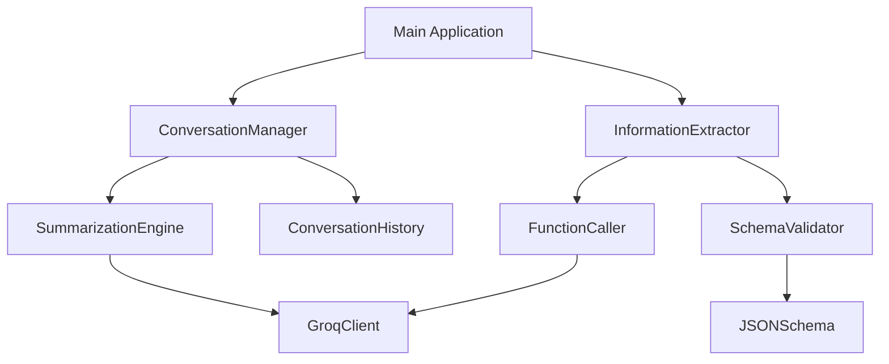

# Design Document

## Overview

The Conversation Management & Classification system is designed as a modular Python application that leverages the Groq API with OpenAI SDK compatibility. The system consists of two main components: a conversation manager with intelligent summarization capabilities, and a structured information extraction system using JSON schemas and function calling.

## Architecture

The system follows a clean, modular architecture with the following key components:



### Core Components

1. **ConversationManager**: Manages conversation history and orchestrates summarization
2. **SummarizationEngine**: Handles different summarization strategies and Groq API integration
3. **InformationExtractor**: Manages structured data extraction using function calling
4. **SchemaValidator**: Validates extracted data against predefined JSON schemas
5. **GroqClient**: Wrapper for Groq API interactions using OpenAI SDK

## Components and Interfaces

### ConversationManager Class

```python
class ConversationManager:
    def __init__(self, groq_client, summarization_config)
    def add_message(self, role: str, content: str) -> None
    def get_history(self, truncation_config: dict = None) -> List[dict]
    def summarize_if_needed(self) -> bool
    def force_summarize(self) -> str
    def reset_history(self) -> None
```

**Key Features:**
- Maintains chronological message history with metadata
- Supports multiple truncation strategies (by turns, by length)
- Implements periodic summarization based on configurable thresholds
- Preserves recent messages during summarization

### SummarizationEngine Class

```python
class SummarizationEngine:
    def __init__(self, groq_client)
    def summarize_conversation(self, messages: List[dict]) -> str
    def apply_truncation(self, messages: List[dict], config: dict) -> List[dict]
    def should_summarize(self, message_count: int, threshold: int) -> bool
```

**Truncation Strategies:**
- **By Turns**: Keep last N conversation turns
- **By Length**: Truncate based on character/word count
- **Hybrid**: Combine both strategies with priority rules

### InformationExtractor Class

```python
class InformationExtractor:
    def __init__(self, groq_client, schema_config)
    def extract_information(self, chat_text: str) -> dict
    def validate_extraction(self, extracted_data: dict) -> bool
    def get_extraction_schema(self) -> dict
```

**Extraction Schema:**
```json
{
  "type": "object",
  "properties": {
    "name": {"type": "string", "description": "Person's full name"},
    "email": {"type": "string", "format": "email", "description": "Email address"},
    "phone": {"type": "string", "pattern": "^[+]?[0-9\\s\\-\\(\\)]+$", "description": "Phone number"},
    "location": {"type": "string", "description": "Geographic location or address"},
    "age": {"type": "integer", "minimum": 0, "maximum": 150, "description": "Person's age"}
  },
  "required": [],
  "additionalProperties": false
}
```

### GroqClient Wrapper

```python
class GroqClient:
    def __init__(self, api_key: str)
    def chat_completion(self, messages: List[dict], **kwargs) -> str
    def function_call(self, messages: List[dict], functions: List[dict]) -> dict
    def validate_response(self, response) -> bool
```

## Data Models

### Message Structure
```python
@dataclass
class Message:
    role: str  # 'user', 'assistant', 'system'
    content: str
    timestamp: datetime
    metadata: dict = field(default_factory=dict)
```

### Conversation History Structure
```python
@dataclass
class ConversationHistory:
    messages: List[Message]
    summary: Optional[str] = None
    last_summarized_at: Optional[datetime] = None
    total_turns: int = 0
```

### Extraction Result Structure
```python
@dataclass
class ExtractionResult:
    extracted_data: dict
    confidence_score: float
    validation_errors: List[str]
    raw_response: dict
```

## Error Handling

### API Error Handling
- **Rate Limiting**: Implement exponential backoff with jitter
- **Network Errors**: Retry logic with configurable attempts
- **Authentication Errors**: Clear error messages and validation
- **Invalid Responses**: Graceful degradation and error reporting

### Data Validation Errors
- **Schema Violations**: Detailed error messages with field-specific feedback
- **Type Mismatches**: Automatic type coercion where possible
- **Missing Required Fields**: Clear indication of what's missing
- **Format Errors**: Specific validation error messages

### Conversation Management Errors
- **Memory Limits**: Automatic summarization when limits are reached
- **Summarization Failures**: Fallback to truncation strategies
- **History Corruption**: Recovery mechanisms and data integrity checks

## Testing Strategy

### Unit Testing
- **ConversationManager**: Test message addition, history retrieval, summarization triggers
- **SummarizationEngine**: Test different truncation strategies and API integration
- **InformationExtractor**: Test schema validation and function calling
- **GroqClient**: Test API wrapper functionality and error handling

### Integration Testing
- **End-to-End Conversation Flow**: Test complete conversation management lifecycle
- **API Integration**: Test actual Groq API calls with mock and real responses
- **Schema Validation**: Test extraction with various chat samples
- **Error Scenarios**: Test system behavior under various failure conditions

### Demonstration Testing
- **Sample Conversations**: Prepare diverse conversation samples for testing
- **Truncation Scenarios**: Test different truncation settings and their outputs
- **Periodic Summarization**: Demonstrate k-th run summarization with clear examples
- **Information Extraction**: Test extraction accuracy with varied chat content

### Performance Testing
- **Memory Usage**: Monitor conversation history memory consumption
- **API Response Times**: Measure and optimize API call performance
- **Summarization Efficiency**: Test summarization quality vs. speed trade-offs
- **Concurrent Operations**: Test system behavior under concurrent requests

## Implementation Considerations

### Configuration Management
- **Environment Variables**: API keys and sensitive configuration
- **Config Files**: Summarization thresholds, schema definitions, truncation settings
- **Runtime Configuration**: Dynamic adjustment of parameters during execution

### Logging and Monitoring
- **API Call Logging**: Track API usage, response times, and errors
- **Conversation Metrics**: Monitor conversation length, summarization frequency
- **Extraction Accuracy**: Track successful extractions and validation failures
- **Performance Metrics**: Response times, memory usage, error rates

### Security Considerations
- **API Key Management**: Secure storage and rotation of API credentials
- **Data Privacy**: Ensure conversation data is handled securely
- **Input Validation**: Sanitize all user inputs before processing
- **Output Sanitization**: Clean extracted data before storage or display

### Scalability Design
- **Modular Architecture**: Easy to extend with new features or API providers
- **Configurable Limits**: Adjustable thresholds for different use cases
- **Memory Management**: Efficient handling of large conversation histories
- **API Rate Limiting**: Built-in respect for API usage limits